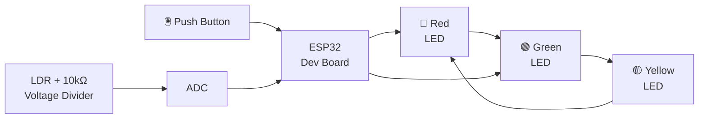
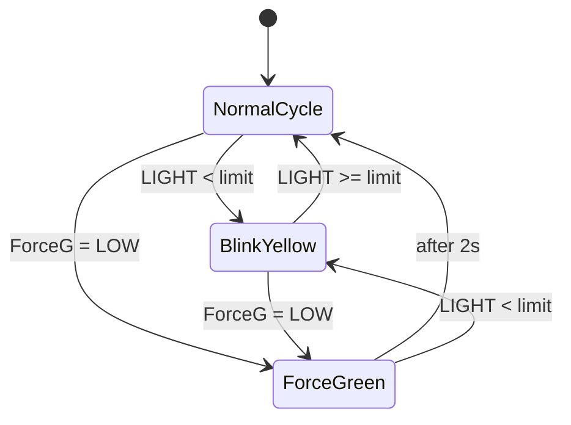

# Intelligent Traffic Light with ESP32 — Documentation

## Overview
This project simulates an intelligent traffic light using an ESP32. It runs a standard LED sequence, allows a manual override to force green light via a button, and enters an energy-saving mode (blinking yellow) based on ambient light detected by an LDR sensor.

## 🎯 Objectives
- Implement a standard traffic light sequence (Red → Green → Yellow).
- Add a manual override to force the green light using a push button.
- Detect low ambient light using an LDR sensor and switch to blinking yellow mode.


## 🧰 Materials and Components
| Component             | Quantity | Description                                   |
|-----------------------|----------|-----------------------------------------------|
| ESP32 Dev Board       | 1        | Microcontroller                               |
| Red LED               | 1        | For Red signal                                |
| Yellow LED            | 1        | For Yellow signal                             |
| Green LED             | 1        | For Green signal                              |
| Push Button           | 1        | To manually force green light                 |
| Photoresistor (LDR)   | 1        | To detect ambient light level                 |
| 220Ω Resistors        | 3        | For LED current limiting                      |
| 10kΩ Resistor         | 1        | For LDR voltage divider                       |
| Breadboard & Wires    | x        | For prototyping                               |

## 🔌 Pin Assignments & Wiring
| Signal       | GPIO Pin | Description                   |
|--------------|----------|-------------------------------|
| Red LED      | 27       | Connected to Red LED          |
| Yellow LED   | 26       | Connected to Yellow LED       |
| Green LED    | 25       | Connected to Green LED        |
| Push Button  | 4        | Input with internal pull-up   |
| LDR Sensor   | 34       | Analog input (ADC) for LDR    |

> **_Note:_**  
> The LDR is connected in a _voltage divider configuration_ with a 10kΩ resistor to 3.3V and GND.  
> The voltage at the junction feeds the ADC pin (GPIO 36) to measure ambient light intensity.

## 📈 System Design
### 🔴🟡🟢 Normal Traffic Light Sequence
- Red → Green → Yellow → repeat
- Durations:
  - Red: 1.5 seconds
  - Green: 1 second
  - Yellow: 0.3 seconds

### 🟢 Forced Green Mode
- If the push button is pressed, the green light is turned on for 2 seconds.
- After that, the system resumes the normal cycle.

### 🌙 Energy Saving Mode (Blinking Yellow)
- When the LDR detects ambient light below a threshold (e.g., during night), the traffic light switches to a blinking yellow mode for safety and power conservation.

## 🧠 Logic Flow
### 🧱 Block Digram

### 🧠 Logic Flow
```plaintext
                +------------------+
                |  Read LDR Value  |
                +--------+---------+
                         |
                Light < Threshold? -- Yes --> Blinking Yellow Loop
                         |
                        No
                         |
                +--------------------+
                |  Button Pressed?   |
                +--------+-----------+
                         |
                        Yes --> Forced Green for 2s
                         |
                        No
                         |
                Run Normal Traffic Cycle
```

### 🔄 State Diagram


## ⏱️ Timing Details
| Mode	    | Duration  |
|-----------|-----------|
|Red Light  |	1.5s    |
|Green Light|	1s      |
Yellow Light|	0.3s    |
Forced Green|	2s      |
Blinking Yellow|	500ms on/off|

## ⚠️ Notes on Implementation
- The push button input is read without debouncing. This could cause multiple triggers due to mechanical bounce.

- The LDR threshold should be calibrated based on ambient conditions for effective light detection.

- Repeated button presses during the forced green period will extend the green light timer.

- The transition between modes is dynamic and responsive to real-time conditions.

## 📁 File Structure
```plaintext
.
├── README.md             # Project documentation (this file)
├── SmartTraffic.ino      # Arduino code for ESP32 logic       
└── LICENSE               
```
### 📜 License
This project is licensed under the MIT License.
Feel free to use, modify, and distribute it with attribution.
